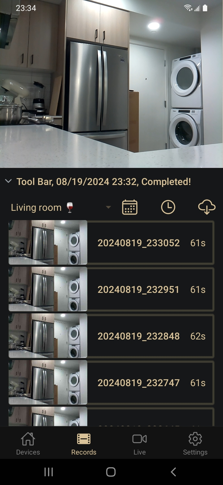
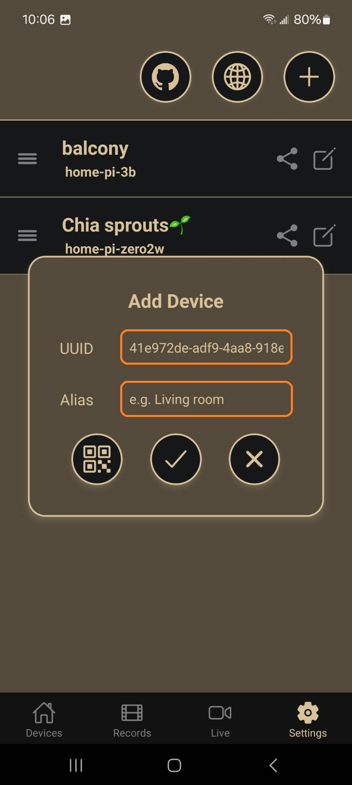
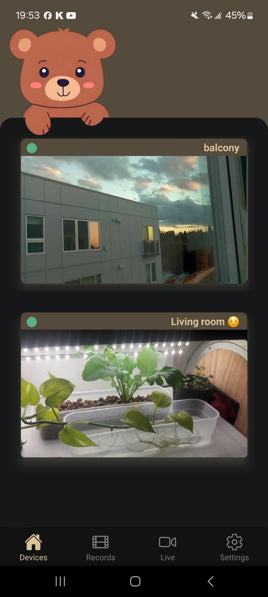

# Pi Camera

<a href="https://play.google.com/store/apps/details?id=com.tzu.huan.tai.picamera"></a>

Transform your Raspberry Pi into a powerful home security camera with the Pi Camera app. Using peer-to-peer (P2P) communication over WebRTC to make a decentralized monitor system, this app connects directly to your Raspberry Pi, allowing you to monitor live video with minimal delay and access historical footage.



## Key Features

👉 **Low-Latency Live Monitoring**: Achieve extremely low-latency video streaming through WebRTC technology, ensuring you don’t miss any important moments.

👉 **Playback of Historical Footage**: Easily view and manage recorded videos to meet your security needs.

👉 **Simple Setup**: Quickly configure your Raspberry Pi camera through a user-friendly interface.

👉 **Privacy Protection**: Direct P2P connection without relying on third-party servers ensures that your data is fully under your control.

👉 **Open-Source Support**: The camera source code is fully open-source, allowing you to customize and extend it as needed.

## Setting Up a New Raspberry Pi

### Step 0: Prerequisites

1. A Raspberry Pi with a camera module attached.
2. An MQTT server, STUN server, and TURN server set up and running.

***Important Notice***
- *MQTT Server (necessary): Please use the same setting on your raspberry pi camera program. You can setup own MQTT server, or choose some free plans including but not limited to [HiveMQ](https://www.hivemq.com), [EXMQ](https://www.emqx.com/en).*
- *STUN Server (optional): If it's empty, the Google STUN server `stun:stun.l.google.com:19302` will be used by default.*
- *TURN Server (optional): This is used for a few mobile networks or specific scenarios. If your NAT setup doesn't allow for p2p hole-punching, the TURN Server will help relay data transfers.*

### Step 1: Set Configurations on the App

1. Go to Setting Page.
2. Click 🌐 icon and paste your servers setting.
Here is an example mqtt setting shown on HiveMQ.
- **Notice!** The MQTT port is the port over WebSocket!

    <br>
    

### Step 2: Add a New Device in the Setting Page

1. Click ➕ icon
2. The App is going to generate a `UUID`, which will be used on your raspberry pi later. *You can edit the `uuid` at the beginning, if you'd like to edit it in the future, please delete it and then add a new device again.*
3. Enter a name in "Alias", which can be edited at any time in the future.
4. Drag the ☰ can change the order of devices shown on selectors and home page.

    

### Step 3: Run Camera Software on Raspberry Pi

Run the `pi_webrtc` in the background with the same `uuid` and `mqtt` setting.

Here shows a example for `uuid` = *`home-pi-zero2w`*. **Notice!** The MQTT port in the command line is ***NOT*** the port over WebSocket `8884`, but the MQTT protocol port `8883`!

```bash
/path/to/pi_webrtc --device=/dev/video0 --fps=30 --width=1280 --height=960 --v4l2_format=h264 --hw_accel --mqtt_host=example.s1.eu.hivemq.cloud --mqtt_port=8883 --mqtt_username=hakunamatata --mqtt_password=WonderfulPhrase --uid=home-pi-zero2w --record_path=/mnt/ext_disk/video/
```

For detailed setup instructions, please refer to the guide provided on my [RaspberryPi_WebRTC](https://github.com/TzuHuanTai/RaspberryPi_WebRTC) page.

### Step 4: Verify the Connection

- Please switch to the home page, the app will try to connect to Raspberry Pi.

- If everything is correct, the status light will turn green.

- The preview image is refreshed every 90 seconds, and it can be refreshed immediately by scrolling down the page.

    


### Step 5: Share to Other Phones

1. Click the share button on the phone that can connect to Raspberry Pi already. It'll show the QR code.
2. Pick up the second phone click the QR code button in the add device section, and scan the QR code will copy the device, including the network setting, to the second phone. **Notice! The network setting will be replaced in the second phone if set before.**

    
    


## Contact & Support

If you have any questions, need support, or just want to provide feedback, you can reach out via [GitHub Issues](https://github.com/TzuHuanTai/Pi-Camera/issues).
Thank you for using Pi Camera!

---
